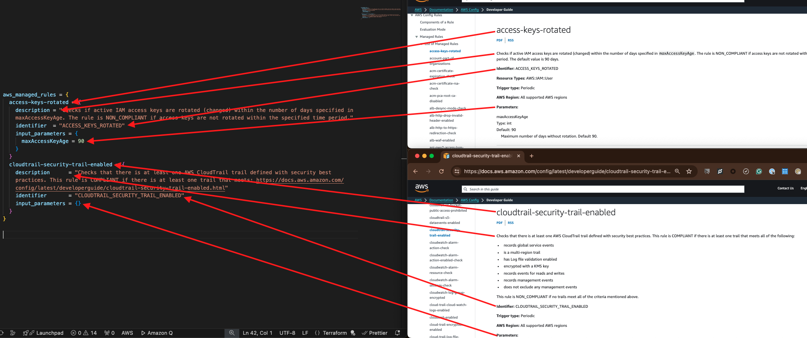

<!-- BEGIN_TF_DOCS -->
<p align="center">                                                                                                                                            
                                                                                
  
  <p align="center">                                                           
    <a href="https://stratusgrid.com/book-a-consultation">Contact Us</a> |                  
    <a href="https://stratusgrid.com/cloud-cost-optimization-dashboard">Stratusphere FinOps</a> |
    <a href="https://stratusgrid.com">StratusGrid Home</a> |
    <a href="https://stratusgrid.com/blog">Blog</a>
  </p>                    
</p>

 # terraform-aws-config-rules

 GitHub: [StratusGrid/terraform-aws-config-rules](https://github.com/StratusGrid/terraform-aws-config-rules)

 Terraform Registry: [StratusGrid/config-rules](https://registry.tf-registry-prod-use1.terraform.io/modules/StratusGrid/config-rules/aws/latest)

 AWS Config rules module to put in standard policies

 Note: Config Rule requires an existing Configuration Recorder to be present. There is available a StratusGrid terraform module to provision it [StratusGrid/config-recorder](https://registry.tf-registry-prod-use1.terraform.io/modules/StratusGrid/config-recorder/aws/latest)
 
 ## Example Single Region Configuration:
 The simplest example deploy the default AWS managed rules we added in the module
 - ROOT_ACCOUNT_MFA_ENABLED
 - IAM_ROOT_ACCESS_KEY_CHECK
 - IAM_USER_MFA_ENABLED

 If you want to disable those default rules set `enable_default_aws_managed_rules = false`

 ```hcl
 module "aws_config_rules_us_east_1" {
  source = "StratusGrid/config-rules/aws"
  # StratusGrid recommends pinning every module to a specific version
  version = "x.x.x"

}
 ```
 ---
 The second example adds besides the default AWS managed rules added in the example 1 the AWS managed rule required_tags_enabled along with the required parameters

 ```hcl
 module "aws_config_rules_us_east_1" {
  source = "StratusGrid/config-rules/aws"
  # StratusGrid recommends pinning every module to a specific version
  version = "x.x.x"

  required_tags_enabled = true
  required_tags = { # Yes, the actual required format is tag#Key and tag#Value
    tag1Key   = "Provisioner"
    tag1Value = "Terraform"
    tag2Key   = "Customer"
    tag3Key   = "Application"
  }

}
 ```
 ---
 The third example use the aws_managed_rules map with two defined rules. The existing AWS Managed rules can be found [here](https://docs.aws.amazon.com/config/latest/developerguide/managed-rules-by-aws-config.html), and you can map them as shown below.

 ```hcl
 module "aws_config_rules_us_east_1" {
  source = "StratusGrid/config-rules/aws"
  # StratusGrid recommends pinning every module to a specific version
  version = "x.x.x"

  aws_managed_rules = {
    access-keys-rotated = {
      description = "Checks if active IAM access keys are rotated (changed) within the number of days specified in maxAccessKeyAge. The rule is NON_COMPLIANT if access keys are not rotated within the specified time period."
      identifier  = "ACCESS_KEYS_ROTATED"
      input_parameters = {
        maxAccessKeyAge = "10"
      }
    }
    cloudtrail-security-trail-enabled = {
      description      = "Checks that there is at least one AWS CloudTrail trail defined with security best practices. This rule is COMPLIANT if there is at least one trail that meets: https://docs.aws.amazon.com/config/latest/developerguide/cloudtrail-security-trail-enabled.html"
      identifier       = "CLOUDTRAIL_SECURITY_TRAIL_ENABLED"
      input_parameters = {}
    }    
  }  
}
 ```
 

 ---
 The fourth example shows the creation of a custom rule using [Guard domain-specific language (DSL)](https://docs.aws.amazon.com/cfn-guard/latest/ug/writing-rules.html)

 ```hcl
 module "aws_config_rules_us_east_1" {
  source = "StratusGrid/config-rules/aws"
  # StratusGrid recommends pinning every module to a specific version
  version = "x.x.x"

  custom_managed_rules = {
    out-of-scope-ec2-instance-families = {
      description = "Ensure EC2 instance configurations do not belong to out-of-scope families."
      scope = {
        compliance_resource_types = ["AWS::EC2::Instance"]
      }
      source = {
        source_detail = {
          message_type = "ConfigurationItemChangeNotification"
        }
        custom_policy_details = {
          policy_runtime = "guard-2.x.x"
          policy_text    = <<POLICY
            rule check_out_of_scope_instance_families when resourceType == "AWS::EC2::Instance" {
                configuration.instanceType != /x1e\.*/
                configuration.instanceType != /x2i\.*/
              }
            POLICY
        }
      }
    }
  }
}
 ```

 ## Example Multi Region Configuration:
 ```hcl
 module "aws_config_rules_us_east_1" {
  source = "StratusGrid/config-rules/aws"
  # StratusGrid recommends pinning every module to a specific version
  version = "x.x.x"

  include_global_resource_rules = true #only include global resource on one region to prevent duplicate rules
  required_tags_enabled = true

  required_tags = { # Yes, the actual required format is tag#Key and tag#Value
    tag1Key   = "Provisioner"
    tag1Value = "Terraform"
    tag2Key   = "Customer"
    tag3Key   = "Application"
  }

  providers = {
    aws = "aws.us-east-1"
  }
}

module "aws_config_rules_us_east_2" {
  source = "StratusGrid/config-rules/aws"
  # StratusGrid recommends pinning every module to a specific version
  version = "x.x.x"

  required_tags_enabled = true

  required_tags = { # Yes, the actual required format is tag#Key and tag#Value
    tag1Key   = "Provisioner"
    tag1Value = "Terraform"
    tag2Key   = "Customer"
    tag3Key   = "Application"
  }

  providers = {
    aws = "aws.us-east-2"
  }
}

module "aws_config_rules_us_west_1" {
  source = "StratusGrid/config-rules/aws"
  # StratusGrid recommends pinning every module to a specific version
  version = "x.x.x"

  required_tags_enabled = true

  required_tags = { # Yes, the actual required format is tag#Key and tag#Value
    tag1Key   = "Provisioner"
    tag1Value = "Terraform"
    tag2Key   = "Customer"
    tag3Key   = "Application"
  }

  providers = {
    aws = "aws.us-west-1"
  }
}

module "aws_config_rules_us_west_2" {
  source = "StratusGrid/config-rules/aws"
  # StratusGrid recommends pinning every module to a specific version
  version = "x.x.x"

  required_tags_enabled = true

  required_tags = { # Yes, the actual required format is tag#Key and tag#Value
    tag1Key   = "Provisioner"
    tag1Value = "Terraform"
    tag2Key   = "Customer"
    tag3Key   = "Application"
  }

  providers = {
    aws = "aws.us-west-2"
  }
}
 ```
 ---

 ## Resources

| Name | Type |
|------|------|
| [aws_config_config_rule.aws_managed_rules](https://registry.terraform.io/providers/hashicorp/aws/latest/docs/resources/config_config_rule) | resource |
| [aws_config_config_rule.custom_managed_rules](https://registry.terraform.io/providers/hashicorp/aws/latest/docs/resources/config_config_rule) | resource |

 ## Inputs

| Name | Description | Type | Default | Required |
|------|-------------|------|---------|:--------:|
| <a name="input_aws_managed_rules"></a> [aws\_managed\_rules](#input\_aws\_managed\_rules) | A list of AWS Managed Rules that should be enabled on the account.<br><br>See the following for a list of possible rules to enable:<br>https://docs.aws.amazon.com/config/latest/developerguide/managed-rules-by-aws-config.html | <pre>map(object({<br>    description      = string<br>    identifier       = string<br>    input_parameters = any<br>  }))</pre> | `{}` | no |
| <a name="input_custom_managed_rules"></a> [custom\_managed\_rules](#input\_custom\_managed\_rules) | A list of AWS Managed Custom Rules that should be enabled on the account.<br><br>Reference<br>https://docs.aws.amazon.com/config/latest/developerguide/evaluate-config_develop-rules.html | `map(any)` | `{}` | no |
| <a name="input_enable_default_aws_managed_rules"></a> [enable\_default\_aws\_managed\_rules](#input\_enable\_default\_aws\_managed\_rules) | True/False to add default Config Rules. Default is true | `bool` | `true` | no |
| <a name="input_input_tags"></a> [input\_tags](#input\_input\_tags) | Map of tags to apply to resources | `map(any)` | <pre>{<br>  "Developer": "StratusGrid",<br>  "Provisioner": "Terraform"<br>}</pre> | no |
| <a name="input_required_tags"></a> [required\_tags](#input\_required\_tags) | Map of tag keys, and optionally values, that are required. | `map(any)` | `{}` | no |
| <a name="input_required_tags_enabled"></a> [required\_tags\_enabled](#input\_required\_tags\_enabled) | True/False to add RequiredTags to Config. Default is false | `bool` | `false` | no |

 ## Outputs

No outputs.

 ---

 <span style="color:red">Note:</span> Manual changes to the README will be overwritten when the documentation is updated. To update the documentation, run `terraform-docs -c .config/.terraform-docs.yml .`
<!-- END_TF_DOCS -->